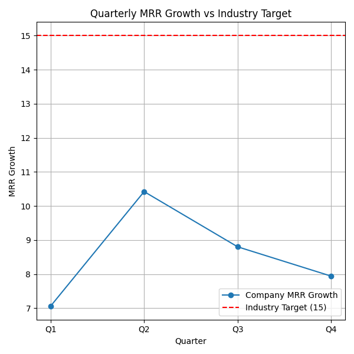

# SaaS Revenue Growth Analysis

📧 Email: 23f1000504@ds.study.iitm.ac.in  

## Key Findings
- The company’s **average MRR growth is 8.56**, well below the **industry benchmark of 15**.  
- Revenue peaked in **Q2 (10.42)** but slowed down in **Q3 (8.8)** and **Q4 (7.94)**.  
- The company is consistently underperforming against industry standards.

## Business Implications
- At the current growth trajectory, the company risks losing market share to faster-growing competitors.  
- A lack of market diversification and over-reliance on existing segments may be contributing to slower growth.

## Recommendation
➡️ The solution: **Expand into new market segments**  
This expansion can unlock untapped customer bases, drive higher adoption, and help close the growth gap.

## Visualization
Below is the quarterly MRR growth trend compared to the industry benchmark:

---
